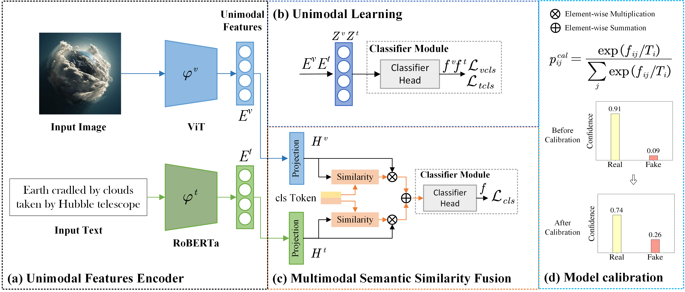
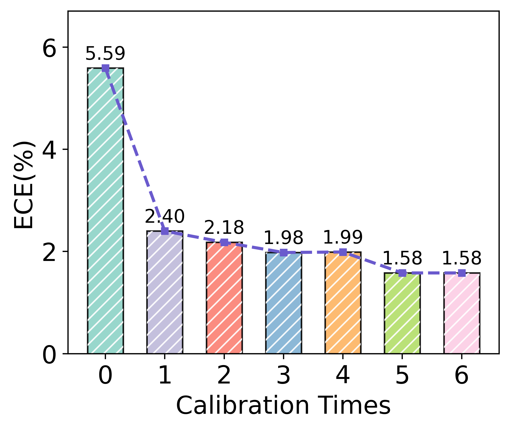
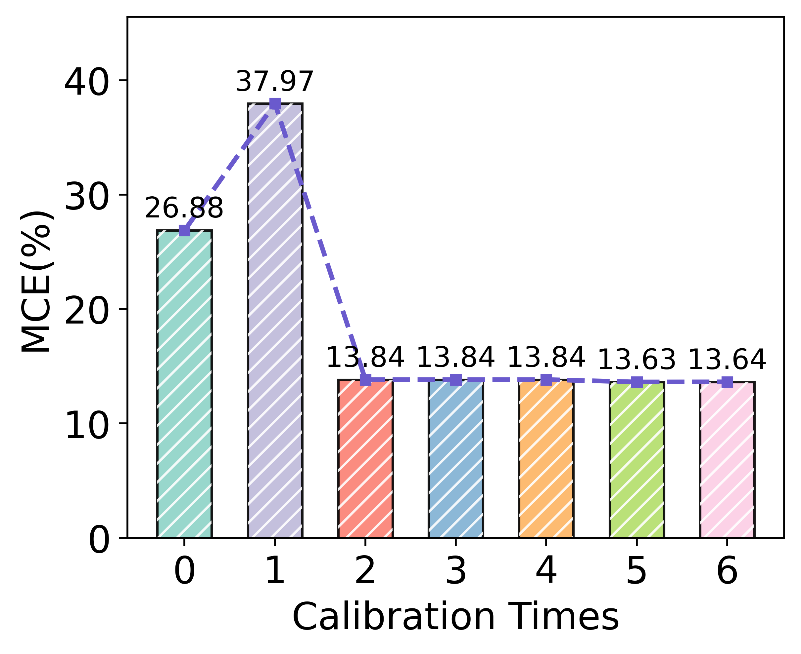
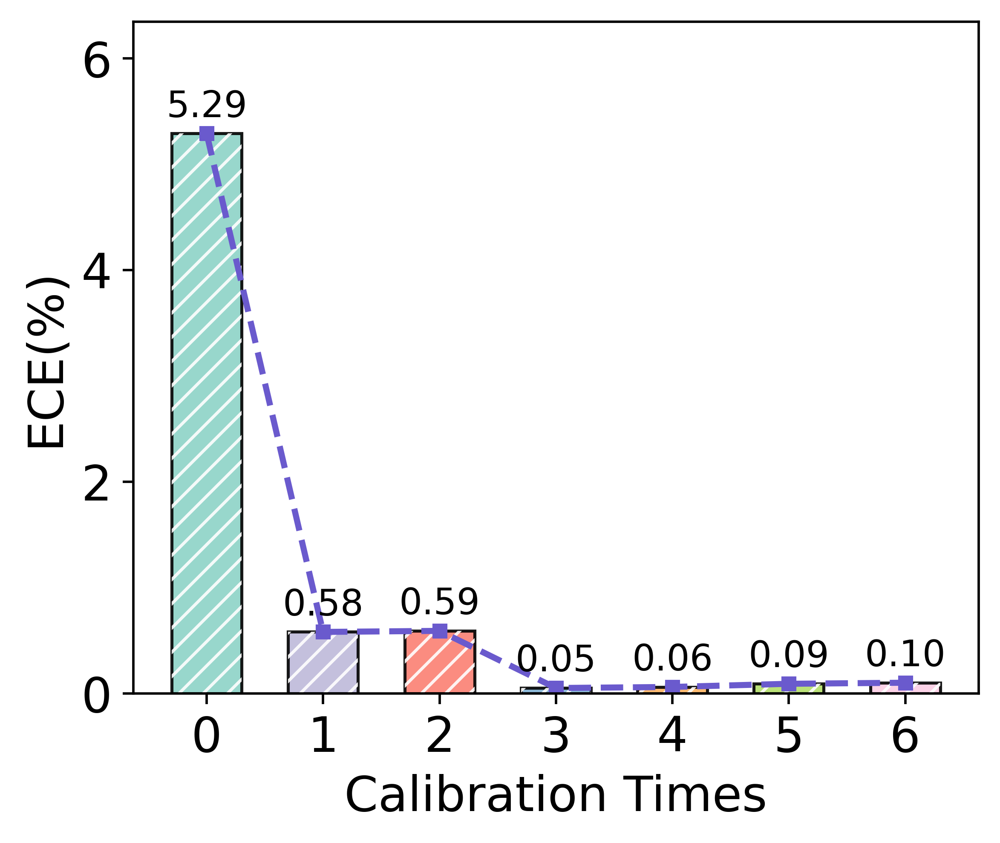
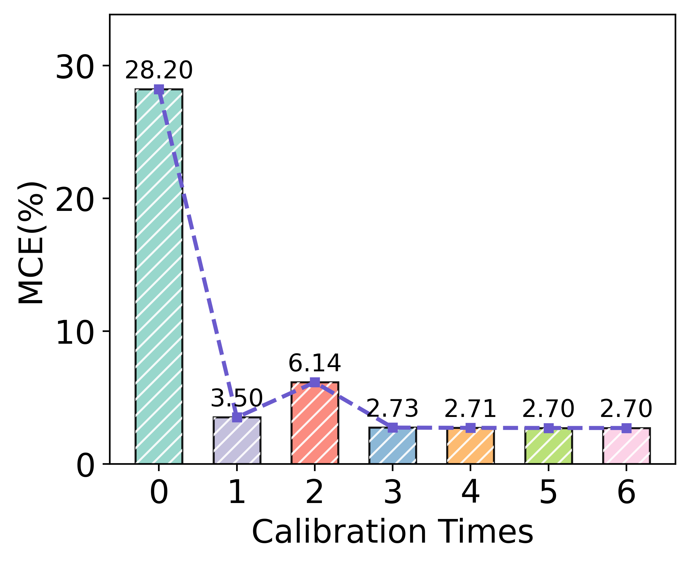

[](https://pubsonline.informs.org/journal/ijoc)

# Confidence-Aware Multimodal Learning for Trustworthy FakeNews Detection

This archive is distributed in association with the [INFORMS Journal on
Computing](https://pubsonline.informs.org/journal/ijoc) under the [MIT License](LICENSE).

The software and data in this repository are a snapshot of the software and data
that were used in the research reported on in the paper 
[Confidence-Aware Multimodal Learning for Trustworthy FakeNews Detection](https://doi.org/10.1287/ijoc.2024.0655.cd) by Shoumeng Ge and Ying Chen. 
The snapshot is based on the author's repository,
[TMFND](https://github.com/dlutor/TMFND).

## Cite

To cite the contents of this repository, please cite both the paper and this repo, using their respective DOIs.

https://doi.org/10.1287/ijoc.2024.0655

https://doi.org/10.1287/ijoc.2024.0655.cd

Below is the BibTex for citing this snapshot of the repository.

```
@misc{CacheTest,
  author =        {Shoumeng Ge and Ying Chen},
  publisher =     {INFORMS Journal on Computing},
  title =         {{Confidence-Aware Multimodal Learning for Trustworthy FakeNews Detection}},
  year =          {2025},
  doi =           {10.1287/ijoc.2024.0655.cd},
  url =           {https://github.com/INFORMSJoC/2024.0655},
  note =          {Available for download at https://github.com/INFORMSJoC/2024.0655},
}  
```

## Description

This repository provides a new framework for trustworthy fake news detection, including the author's developed multi-modal fusion and confidence calibration. Three online datasets are provided to replicate the results in the paper.



# Preparation

The framework is compatible with Python 3.12 and torch >= 2.3.0. Make sure to install the following dependencies:
```bash
scipy
scikit-learn
tqdm
transformers
timm
```

```bash
pip install -r requirements.txt
```

# Datasets
Place the downloaded dataset images in the corresponding directory under `datasets`.

**Twitter:** We follow [CAFE](https://github.com/cyxanna/CAFE) to download the split dataset at [https://pan.baidu.com/s/1Vn75mXe69jC9txqB81QzUQ](https://pan.baidu.com/s/1Vn75mXe69jC9txqB81QzUQ) ( extraction code: 78uo ).

**Weibo**: We use the dataset provided from [EANN-KDD18](https://github.com/yaqingwang/EANN-KDD18), you can download image datas (nonrumor_images/rumor_images) via [https://drive.google.com/file/d/14VQ7EWPiFeGzxp3XC2DeEHi-BEisDINn/view?usp=sharing](https://drive.google.com/file/d/14VQ7EWPiFeGzxp3XC2DeEHi-BEisDINn/view?usp=sharing). (Approximately 1.3GB)

**Fakeddit**: We provide  the proceesed dataset, and just download image datas from the official repository [Fakeddit](https://github.com/entitize/Fakeddit) via [https://drive.google.com/file/d/1cjY6HsHaSZuLVHywIxD5xQqng33J5S2b/view?usp=sharing](https://drive.google.com/file/d/1cjY6HsHaSZuLVHywIxD5xQqng33J5S2b/view?usp=sharing). (Approximately 113.6GB) The label is different from above datasets, and 1 is the real news.

# Train and Test

## Training a fake news detection model
Model training can be started using the following script:

```bash
bash ./scripts/train_twitter.sh
bash ./scripts/train_weibo.sh
bash ./scripts/train_fakeddit.sh
```

## Calibrate model
After training, perform confidence calibration.
```bash
bash ./scripts/train_calibration_twitter.sh
bash ./scripts/train_calibration_weibo.sh
bash ./scripts/train_calibration_fakeddit.sh
```


<!--  -->
